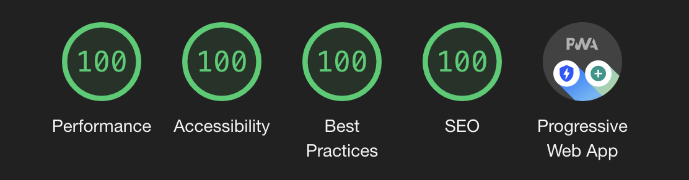

# samgamage.dev

Built with <3 with the amazing [Gatsby.js](https://www.gatsbyjs.org/),
[MDX](https://github.com/mdx-js/mdx) and [Theme-UI](https://theme-ui.com/).

## 🖼️ Features

- [MDX](https://mdxjs.com/): JavaScript/React in Markdown
- [Prism.js](https://github.com/PrismJS/prism): Syntax Highlighting
- Blog Pagination
- [Emotion](https://github.com/emotion-js/emotion)
- Site & Theme config files
- Social media share buttons
- Light and dark mode with [Theme-UI](https://theme-ui.com/)

## ⚙️ Setup & Installation

- `git clone https://github.com/samgamage/samgamage.dev.git`
- `cd samgamage.dev`
- `yarn or npm i`
- `gatsby develop` (if you don't have gatsby cli run `npm i -g gatsby-cli`)
- visit http://localhost:8000
